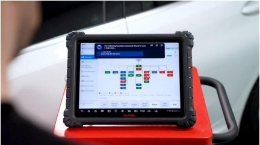
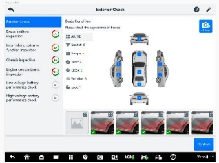

心优势的基础上，通过生成式 AI 在语音、图像、文本、视觉识别等多模态处理上的优势，结合深度学习、大语言模型，深度赋能数字维修垂直领域业务场景，全面推进数字维修业务 AI Agents 化。

报告期内，公司推出 AI 语音助手、AI 车辆外观损伤识别等智能特性，基于汽车诊断维修行业大模型，通过自然语言交互，实现功能查找、帮助询问、界面控制；利用 AI 视觉分析，识别外观损伤，使得维修更智能、更简单、更高效，极大提高诊断产品数智化水平，全面提升用户体验。

道通综合诊断平板 AI 语音助手

道通综合诊断平板 AI 车辆外观损伤识别

未来，公司将分阶段打造故障分析 Agents、故障诊断 Agents、全场景 Agents，向汽车诊断 AaaS（Agent as a Service）全面转型，构建自学习、自演进、自优化的数字维修行业大模型，进一步巩固汽车诊断全球领导者地位。

### （二）数智能源业务——电力电子与AI技术深度融合，第二发展曲线高速发展

根据权威机构预测，2025年，海外充电市场规模预计将达到约800亿元人民币/年，并有望在2030年增长至约1,200亿元人民币/年，具有极为广阔的市场前景。同时，随着技术的快速迭代和客户需求标准的不断提升，行业格局将加速向核心能力领先的头部企业集中。

公司始终坚持以技术创新为驱动，依托电力电子技术与AI智能化技术两大坚实基石，加速推进端到端智能充电网络解决方案、一站式光储充能源管理解决方案，驱动数智能源行业发展，行业影响力持续提升。

## 1、AI技术底座重构能源生态，解决方案全面升级

#### （1）车桩云深度融合，打造领先的智能充电网络解决方案

公司致力于打造业界领先的端到端智能充电网络解决方案。聚焦在途、目的地、车队和家庭四大场景，以智能充电平台为核心，车桩云深度融合，拓展桩网协同和车桩协同能力，为客户提供安全可靠的产品、极致的充电体验和极佳的投资收益。