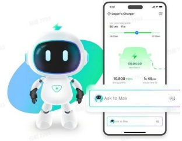
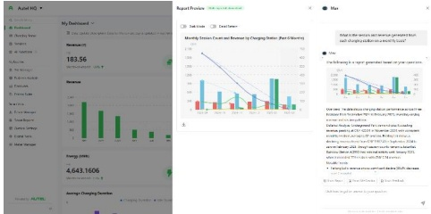

产品解决方案包含“直流超快充、交流家商一体”等系列充电桩平台，以及智能运营、智能运维、充电支付等综合云服务平台。公司凭借深厚的电力电子技术积累和AI技术创新突破，精心打造系列“场站 Agents”，构筑“5i智能”差异化竞争优势，实现“iSafe 三层防护智能安全”、“iCharge 即插即充智能体验”、“iManage 自优自愈智能运维”、“iRevenue 池化调度智能增收”和“iEMS 叠光叠储智能协同”，建立起更智能、更易用、更可靠、更绿色的车桩云生态系统。

基于公司自主研发的数智能源行业大模型，公司分别在用户端和客户端分别开发了APP语音助手、CSMS（充电桩管理平台）智能助手。

● 在用户端，公司成功发布行业内首个充电 APP 智能语音助手——Max，可基于用户行为习惯提供个性化的智能充电操作，使用户能够通过自然语言、语音指令完成充电启停、数据查询、问题反馈等 APP90% 以上的操作，为用户提供了更便捷、更智能化的操作体验。

● 在客户端，公司推出了基于行业大模型的 CSMS 智能化助手，为充电站运营者提供更高效的管理工具。在智能助手引导下，通过自然语言对话，5 分钟即可完成充电站的线上管理系统搭建，并具备智能分析、智能报告、智能问答等功能，该助手可以利用 AI 算法，对充电站的能耗数据、设备运行状况、用户充电需求等进行主动分析汇报，优化充电站运营调度，提升整体效率。

充电 APP 智能语音助手

CSMS 助手智能分析操作页面

##### （2）垂域大模型赋能，构建一站式光储充能源管理解决方案

随着新能源车充电需求的日益增长，充电场站正面临电力供应不足，电网扩容成本高，能源运营成本高，充电服务能力弱、充电利用率低等痛点。

公司打造极致安全、极致经济、极致高效的一站式光储充能源管理解决方案。以充电为切入点，以智能化能源管理为核心，融合“光、储、充、边、云”，基于发电和负载预测，结合能源优化、智能充电、智能调度和电池检测等算法，实现充电侧需