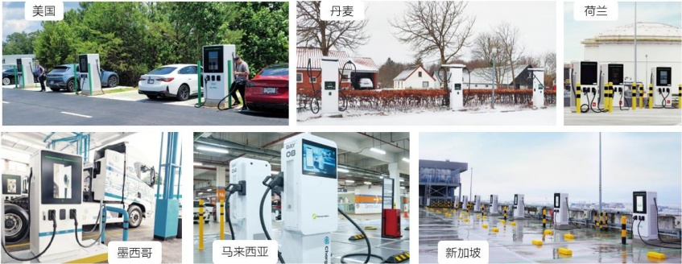

公司的新能源足迹正在全球多点开花，新能源业务版图正在全球快速扩张，这不仅彰显了公司在技术创新、市场开拓及客户服务方面的卓越能力，更为推动全球能源结构转型、促进绿色低碳发展贡献了重要力量。

道通数智能源部分项目展示

## 3、深化海外市场本土化建设，品牌影响力持续增强

自 2021 年前瞻性布局数智能源业务以来，公司大力推进海外市场本土化建设，重点培育和打造海外本土营销团队，进一步夯实并拓展了全球营销体系。截至本报告期末，公司已在全球建立了近 20 个海外区域总部、销售平台和子公司。同时，公司不断拓展和深化与合作伙伴关系，加强与当地政府、行业组织、社区及大型企业的合作，以增强市场影响力和竞争优势。

2024 年，公司筹划并发起 “Evergreen” 全球 ESG 植树活动，携手全球六大区域的权威公益组织，深度助力逾 20 家战略客户巩固其全球绿色品牌形象，充分展现出行业领导者的责任担当与影响力。在报告期内，公司在全球范围内共举办 95 场展会，与超过 70 家的领先垂直媒体建立联系，并荣获多个区域性市场奖项，全年全渠道总曝光量超 60 亿次，全面深化了公司行业解决方案专家的形象。这些举措显著增强了公司的品牌影响力，同时也向客户表明了不断进取的决心。