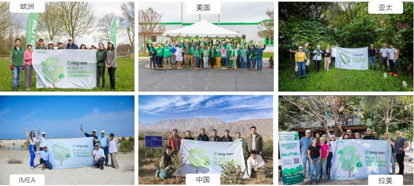

道通 “Evergreen” 全球 ESG 植树活动

## （三）空地一体集群智慧解决方案——开启 AI+机器人业务，第三发展曲线应运而生

在智慧能源、智能交通领域，传统的人工巡检和监测手段已经无法满足不同场景、工况的巡检需求；而无人机巡检尤其考验飞手与无人机的配合程度，效率低、可复制性弱，商业空间有限。在低空经济和具身智能行业飞速发展的背景下，融合飞行智能体、地面机器人等智能体机器人以更智能、高效的方式，在更大范围内完成巡检作业是大势所趋，空地一体解决方案将赋能千行百业。

基于对客户需求的深刻洞察，报告期内，公司推出空地一体集群智慧解决方案，该方案整合系列 AI PaaS 平台、三大垂直领域模型及具身智能硬件矩阵，涵盖飞行智能体、地面机器人等核心组件，能够实现从行业大模型、智能大脑、智慧机器人执行器和场景数据全链条拉通，具有高效、智能、持续快速自我演进的能力，将以更智能、高效的方式，赋能行业向数智化、无人化和空地一体化的新型作业模式转变，有效降低客户成本，提升作业效率，提高作业质量，提增作业效益。

在团队建设方面，公司现已建立起极具竞争力的核心技术团队，团队成员在AI大模型方面积累了大量前沿技术，曾构建过生成式垂域AI模型并成功商业化，是公司在AI领域的持续发展的有力保障。

● 在模型能力方面，公司持续对包括 Chatgpt、DeepSeek、Llama、Qwen 等国内外前沿基础大模型算法进行合作应用，依据业务需求进行针对性垂域模型训练，并开展深入的算法创新与应用开发。目前，公司已完成 Deepseek 的全面接入和本地化部署，并应用 DeepSeek 训练流程，加速推进以巡检垂