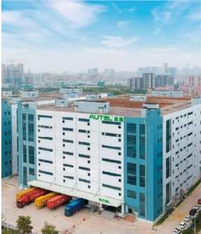
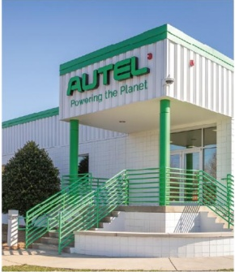
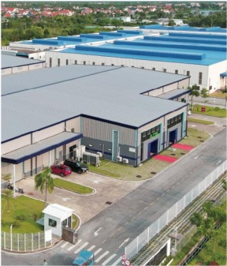

场的全面覆盖，全方位提升了供给能力和速度。此外，公司进一步加强物流精细化管控，提升了物流效率，确保了客户能够享受到更加快速、可靠的产品交付服务。

这一系列全球供应链的战略部署，不仅为公司灵活应对国际贸易环境变化、提升抗风险能力提供了重要保障，还通过本地化生产与仓储物流的持续优化，进一步增强响应速度与市场竞争力，为公司业务的持续高质量发展奠定了坚实基础。

中国深圳工厂

美国北卡罗来纳州工厂

越南海防工厂

（五）深化数智化转型，全员拥抱 AI 变革

## 1、深入推进数智化转型，持续优化运营效率

报告期内，公司深入推进以数智化与 AI 驱动的变革，持续推动管理创新与业务转型，持续优化内外部运营效率，致力于构建以 AI 驱动的智能商业生态系统。报告期内，以下多个重要项目取得显著进展：

<table border=1 style='margin: auto; word-wrap: break-word;'><tr><td style='text-align: center; word-wrap: break-word;'>业务领域</td><td style='text-align: center; word-wrap: break-word;'>项目名称</td><td style='text-align: center; word-wrap: break-word;'>项目成果</td></tr><tr><td rowspan="3">研发</td><td style='text-align: center; word-wrap: break-word;'>IPD 重建项目</td><td style='text-align: center; word-wrap: break-word;'>构建可持续推出有竞争力产品的管理体系，打造贯穿研产销服、流程驱动的价值链支撑</td></tr><tr><td style='text-align: center; word-wrap: break-word;'>研发数字化建设</td><td style='text-align: center; word-wrap: break-word;'>实现业务数据端到端管理，提升研发设计效率</td></tr><tr><td style='text-align: center; word-wrap: break-word;'>AI DevOps 平台</td><td style='text-align: center; word-wrap: break-word;'>贯通项目管理、需求分析、系统设计、开发测试等研发全生命周期的智能化管理，大幅提升研发效率</td></tr><tr><td rowspan="2">营销服</td><td style='text-align: center; word-wrap: break-word;'>ITR 全球服务数字化变革项目</td><td style='text-align: center; word-wrap: break-word;'>持续优化产品可靠性指标及售后服务指标，显著改善客户服务体验</td></tr><tr><td style='text-align: center; word-wrap: break-word;'>AI 智能电话坐席</td><td style='text-align: center; word-wrap: break-word;'>支持 8 国语言，7*24 小时自动服务</td></tr><tr><td style='text-align: center; word-wrap: break-word;'>供应链</td><td style='text-align: center; word-wrap: break-word;'>MES、WMS 项目</td><td style='text-align: center; word-wrap: break-word;'>物料全流程质量追溯，生产过程全数据采集</td></tr><tr><td style='text-align: center; word-wrap: break-word;'>职能</td><td style='text-align: center; word-wrap: break-word;'>IDS 经营管理驾驶舱项目</td><td style='text-align: center; word-wrap: break-word;'>建立完整的通道指标体系，提升决策效率和管理水平，实现运营过程可视、问题可控、异常可溯</td></tr><tr><td style='text-align: center; word-wrap: break-word;'>IT</td><td style='text-align: center; word-wrap: break-word;'>基础架构</td><td style='text-align: center; word-wrap: break-word;'>全面提升 IT 环境稳定性、安全性，通过优化基础架构部署方式等提升可用性，降低成本</td></tr></table>

## 2、全员拥抱 AI 变革，全面激活组织战斗力