报告期内，公司积极组织开展 AI 学习活动，掀起了全员学习 AI 的热潮。公司举办了 6 场 “AI 大讲堂”，邀请行业技术专家定期开展 AI 前沿趋势与实践分享活动，参训员工逾 1,500 人次，全面提升了员工的数字化思维和技能。

此外，公司还举办了 AI Hackthon “道通科技 AI 提效大赛”，鼓励各部门挖掘 AI 提效点，营造百花齐放的创新氛围。截至 2025 年 2 月末，在 “AI 提效大赛” 的前期赋能阶段，已成功举办 16 场培训活动，参训员工逾 2,100 人次，人均学习课时达 3.2 小时。现阶段已完成涵盖 AI 知识普及、自动编程、Agent 实践、工具实践以及平台搭建等内容，有力推动了道通员工的自我发展，为公司在智能化时代保持竞争优势提供了助力。

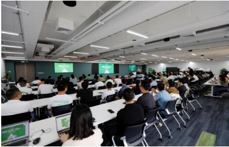

“AI大讲堂”培训现场

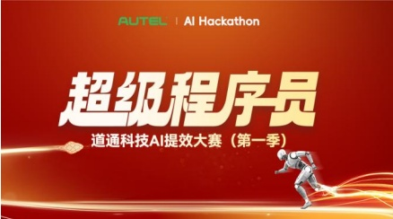

AI Hackthon “道通科技 AI 提效大赛”

##### 非企业会计准则业绩变动情况分析及展望

□适用 √不适用

### 二、报告期内公司所从事的主要业务、经营模式、行业情况及研发情况说明

### (一)主要业务、主要产品或服务情况

## 1、主要产品简介

报告期内，公司专注于汽车数字维修、新能源智能充电领域，提供全球领先的综合诊断检测解决方案、全场景智能充电网络解决方案和一站式光储充能源管理解决方案。

公司主要产品简介及图示如下：

<table border=1 style='margin: auto; word-wrap: break-word;'><tr><td style='text-align: center; word-wrap: break-word;'>一级分类</td><td style='text-align: center; word-wrap: break-word;'>二级分类</td><td style='text-align: center; word-wrap: break-word;'>产品简介</td><td style='text-align: center; word-wrap: break-word;'>图示</td></tr><tr><td style='text-align: center; word-wrap: break-word;'>汽车综合诊断产品</td><td style='text-align: center; word-wrap: break-word;'>乘用车&amp;商用车综合诊断产品</td><td style='text-align: center; word-wrap: break-word;'>产品通过计算机技术对汽车内部电控系统进行全自动化检测，帮助使用者了解汽车故障的类型、</td><td style='text-align: center; word-wrap: break-word;'></td></tr><tr><td rowspan="2"></td><td style='text-align: center; word-wrap: break-word;'></td><td style='text-align: center; word-wrap: break-word;'>产生原因、故障发生位置从而检修汽车。公司产品全面支持主流品牌不同车型，具备覆盖车型广、准确率高、易用等特点，为客户提供全面的诊断服务，主要服务于大中型独立维修机构。结合自研行业大模型，具有AI语音助手、AI车辆外观损伤识别等智能特性。</td><td style='text-align: center; word-wrap: break-word;'>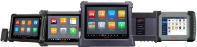</td></tr><tr><td style='text-align: center; word-wrap: break-word;'>新能源综合诊断产品及工具链</td><td style='text-align: center; word-wrap: break-word;'>新能源汽车诊断系统，支持新能源汽车高压系统诊断，能快速读取电池包数据，查看电池包详细信息。结合电池充放电机、电芯均衡仪、电池包气密性检测仪以及绝缘检测仪等高压锂电池维护场景的工具链产品，可实现新能源汽车从车上到车下诊断场景的全面覆盖。结合自研行业大模型，具有AI语音助手、AI车辆外观损伤识别等智能特性。</td><td style='text-align: center; word-wrap: break-word;'>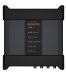 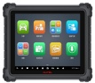 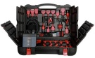 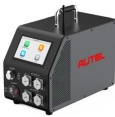 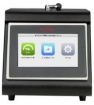 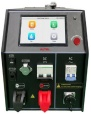 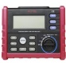 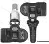 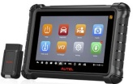 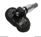</td></tr><tr><td style='text-align: center; word-wrap: break-word;'>TPMS系列产品</td><td style='text-align: center; word-wrap: break-word;'>TPMS产品</td><td style='text-align: center; word-wrap: break-word;'>TPMS Sensor（胎压传感器）产品为通用型智能胎压传感器产品，该产品可通过配套工具进行无线编程，可与各种品牌的车型完成匹配；TPMS系统诊断匹配工具产品为专门用于胎压系统检测和胎压传感器激活、编程和学习的小型便携式手持设备，支持读/写ID、读码清码、关闭故障灯等功能，可读取并显示传感器详细参数，记录并回放传感器数据，对传感器的位置和ID进行识别。</td><td style='text-align: center; word-wrap: break-word;'>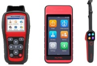</td></tr><tr><td style='text-align: center; word-wrap: break-word;'>ADAS系列产品</td><td style='text-align: center; word-wrap: break-word;'>ADAS标定工具</td><td style='text-align: center; word-wrap: break-word;'>产品集成自适应巡航控制、车道偏离警告、夜视、盲点检测等高级辅助驾驶系统的标定功能，通过标定工具、诊断软件和标定方法的综合集成，可以大幅提高ADAS系统的标定效率。</td><td rowspan="2">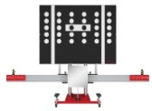 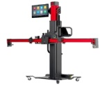 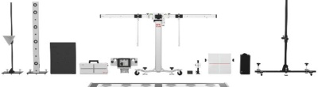</td></tr><tr><td style='text-align: center; word-wrap: break-word;'>诊断软件云服务</td><td style='text-align: center; word-wrap: break-word;'>车型更新</td><td style='text-align: center; word-wrap: break-word;'>产品为诊断检测应用软件所覆盖车型更新及功能拓展服务。</td></tr><tr><td rowspan="3">智能充电网络解决方案</td><td style='text-align: center; word-wrap: break-word;'>交流充电桩</td><td style='text-align: center; word-wrap: break-word;'>产品包括7kW-22kW的欧标、美标交流桩，主要应用场景包括家用、商超、写字楼等。自研开发的AI语音助手为用户提供个性化的智能充电操作。产品已通过CE、TUV、UKCA、UL、CSA、PTB、CTEP、能源之星、CQC、TR25、LNO等多个世界权威认证。</td><td style='text-align: center; word-wrap: break-word;'>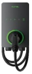 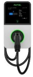 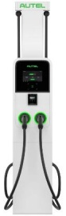  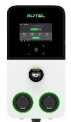</td></tr><tr><td style='text-align: center; word-wrap: break-word;'>直流充电桩</td><td style='text-align: center; word-wrap: break-word;'>产品包括40kW-1440kW的欧标、美标一体及分体式直流桩、超充桩及MCS（兆瓦级）充电终端，主要应用场景包括高速服务区、加油站、车队、商超连锁等。自研开发的AI语音助手为用户提供个性化的智能充电操作。商用超充单枪满配功率480kW，实现充电十分钟，续航约600公里；支持MCS兆瓦级充电，最大电流1500A，充电功率可达1.2MW。</td><td style='text-align: center; word-wrap: break-word;'>[F2: [F7] [F [F22]</td></tr><tr><td style='text-align: center; word-wrap: break-word;'>运维管理</td><td style='text-align: center; word-wrap: break-word;'>使用AI预测性维护，前置检修降低故障发生率，且具备基本的远程诊断能力及一定的远程修复能</td><td style='text-align: center; word-wrap: break-word;'></td></tr><tr><td rowspan="2"></td><td style='text-align: center; word-wrap: break-word;'></td><td style='text-align: center; word-wrap: break-word;'>力，能够有效降低人工运维成本。</td><td rowspan="2"></td></tr><tr><td style='text-align: center; word-wrap: break-word;'>充电云平台</td><td style='text-align: center; word-wrap: break-word;'>提供场桩管理、场站运营、经营分析、多租户管理、智能充电等功能，能够提升运营商管理效率。基于行业大模型的CSMS（充电站管理系统）AI智能化助手，为充电站运营者提供更高效的管理工具。</td></tr><tr><td rowspan="2">一站式光储充能源管理解决方案</td><td style='text-align: center; word-wrap: break-word;'>能源边缘控制器</td><td style='text-align: center; word-wrap: break-word;'>提供多端口、多协议、多品牌、多设备类型的数据采集、分析、处理能力，边缘计算与存储、云/边协同调度策略等功能，能够实时监控能源系统的运行状态，为用户提供全面、准确的能源数据支持。</td><td style='text-align: center; word-wrap: break-word;'>[F4[F3]</td></tr><tr><td style='text-align: center; word-wrap: break-word;'>能源管理平台</td><td style='text-align: center; word-wrap: break-word;'>提供多站点能源监控、场站能源分析、能源优化与AI调度策略算法、设备综合管理、设备告警与智能预警等功能，实现市电平滑扩容、降低能源成本，提高充电利用率，为用户提供全面、准确的能源数据支持与决策建议。</td><td style='text-align: center; word-wrap: break-word;'>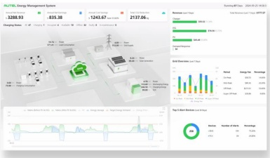</td></tr></table>