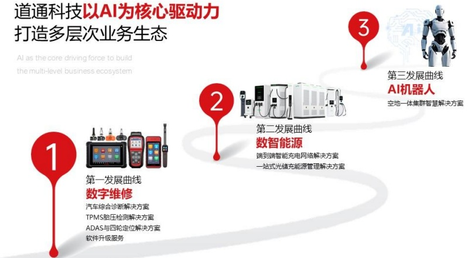

型打造一站式光储充能源管理解决方案。

● 面对生成式 AI 技术的历史性发展机遇，公司于 2024 年战略布局 AI 机器人业务，初期聚焦为智慧能源、智能交通等应用场景空地一体集群智慧解决方案，为客户提供数智化、无人化、空地一体化多机异构整体解决方案。

### (二)主要经营模式

## 1、数字维修业务

#### （1）采购模式

公司一般按照 “以产定购” 的模式，根据的销售预测、运输途径、市场供应、库存及生产等因素制定相应的采购计划并确定采购数量等内容，主要包括制订采购计划、下达采购订单以及交货付款等环节。采购内容主要为原材料与委外加工服务，原材料主要包括 IC 芯片、液晶显示屏、电阻电容、PCB 电路板、二极管、三极管等电子零部件，一般均采购优秀的工业级产品，其他为结构件、包装件、生产辅料等，委外加工服务主要是深圳制造中心 SMT 环节由外协代工厂加工。考虑当地委外加工服务供给不足的情况，海外越南制造中心自 2020 年已自建 SMT 生产线。

#### (2) 生产模式

公司产品核心技术凝结于汽车综合诊断、检测等应用软件，通过嵌入硬件终端产品从而实现相关诊断检测功能，公司主要进行产品组装、功能测试和质量检验等环节。