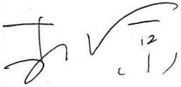

百业，为客户创造更精准、更高效、更全面的价值，致力于成为 AI 行业大模型商业化应用的龙头企业。

##### 致未来：做长期主义者，构筑 AI 时代的护城河

各位投资者，AI浪潮席卷全球，产业格局正重塑。当此之时，道通科技不做追风者，而争做时代浪潮中的掌舵人。

我们深知，AI 真正的价值，绝非技术炫耀，而在于踏踏实实地为行业解决具体问题——让每辆汽车的诊断更精准，让每一度绿色能源利用更高效，让机器人能更自主地协同作业。而这些的背后，需要有长期主义者的笃定与耐心。

二十年风雨兼程，道通科技从深圳出发，走向世界；未来十年，我们将以 AI 为引擎，持续撬动绿色能源、低空经济、具身智能三大万亿级产业机会。这条道路虽不平坦，但我们深信：与趋势同行，必将成为趋势本身。

星辰大海，虽远必至；与诸君同行，共赴未来！

最后恭祝各位投资人投资顺利、心想事成！

深圳市道通科技股份有限公司董事长

2025年3月