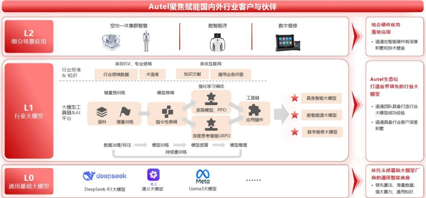

### 六、公司关于公司未来发展的讨论与分析

### (一) 行业格局和趋势

##### ✓适用 ☐不适用

详见 “第三节管理层讨论与分析” 中 “二、报告期内公司所从事的主要业务、经营模式、行业情况及研发情况说明” 的 “（三）所处行业情况。”

### (二) 公司发展战略

##### ✓适用 ☐不适用

随着 AI 技术推动第四次工业革命，各行各业迎来发展新机遇，社会生产效率大幅提升。

一直以来，公司以 AI 为核心驱动力，坚定围绕 “智能化” 战略布局。公司将 AI 作为当前及未来五年最核心的战略，定位 “全面 AI” 化，以 AI 技术为核心驱动引擎，构建生成式 AI 平台与行业大模型，持续研发多种形态的 AI Agents，推动生成式 AI 技术与行业应用场景深度融合，加速其在各行业的落地应用，引领业务生态的革命性变革，持续巩固数字维修全球领导者的地位，致力于成为光储充数智能源领域的全球领军企业、以及空地一体集群智慧解决方案全球领导者，努力打造 AI 行业大模型商业化应用龙头企业。

道通 AI 战略全景

面对新能源绿色革命和人工智能大浪潮，道通将积极拥抱变化，深入贯彻“价值创新，孜孜以求”的经营理念，目标高远，以超越客户期望为标准；行动高效，全面加速AI创新步伐；价值高维，形成新质生产力，持续追求卓越；以更加宽广的视野