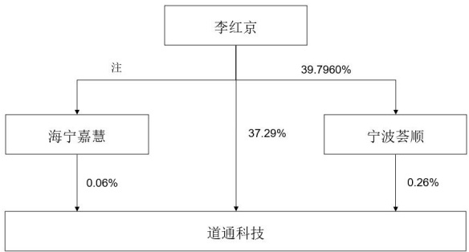

## 四、控股股东及实际控制人情况

## (一)控股股东情况

### 1、法人

□适用 √不适用

### 2、自然人

√适用 □不适用

<table border=1 style='margin: auto; word-wrap: break-word;'><tr><td style='text-align: center; word-wrap: break-word;'>姓名</td><td style='text-align: center; word-wrap: break-word;'>李红京</td></tr><tr><td style='text-align: center; word-wrap: break-word;'>国籍</td><td style='text-align: center; word-wrap: break-word;'>中国</td></tr><tr><td style='text-align: center; word-wrap: break-word;'>是否取得其他国家或地区居留权</td><td style='text-align: center; word-wrap: break-word;'>否</td></tr><tr><td style='text-align: center; word-wrap: break-word;'>主要职业及职务</td><td style='text-align: center; word-wrap: break-word;'>董事长、总经理</td></tr></table>

### 3、公司不存在控股股东情况的特别说明

□适用 √不适用

### 4、报告期内控股股东变更情况的说明

□适用 √不适用

### 5、公司与控股股东之间的产权及控制关系的方框图

✓适用 ☐不适用

注：截至 2024 年 12 月 31 日，海宁嘉慧持有公司 28.9091 万股，占公司总股本的 0.06%，且该部分股份全部归属李红京所有。

## (二)实际控制人情况

### 1、法人

□适用 √不适用