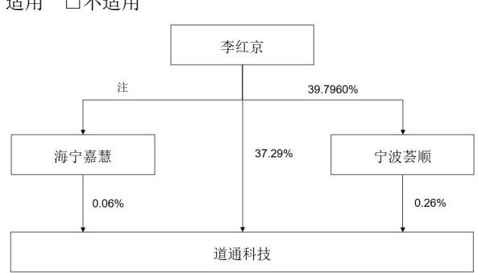

### 2、自然人

√适用 □不适用

<table border=1 style='margin: auto; word-wrap: break-word;'><tr><td style='text-align: center; word-wrap: break-word;'>姓名</td><td style='text-align: center; word-wrap: break-word;'>李红京</td></tr><tr><td style='text-align: center; word-wrap: break-word;'>国籍</td><td style='text-align: center; word-wrap: break-word;'>中国</td></tr><tr><td style='text-align: center; word-wrap: break-word;'>是否取得其他国家或地区居留权</td><td style='text-align: center; word-wrap: break-word;'>否</td></tr><tr><td style='text-align: center; word-wrap: break-word;'>主要职业及职务</td><td style='text-align: center; word-wrap: break-word;'>董事长、总经理</td></tr><tr><td style='text-align: center; word-wrap: break-word;'>过去10年曾控股的境内外上市公司情况</td><td style='text-align: center; word-wrap: break-word;'>无</td></tr></table>

### 3、公司不存在实际控制人情况的特别说明

□适用 √不适用

### 4、报告期内公司控制权发生变更的情况说明

□适用 √不适用

### 5、公司与实际控制人之间的产权及控制关系的方框图

注：截至 2024 年 12 月 31 日，海宁嘉慧持有公司 28.9091 万股，占公司总股本的 0.06%，且该部分股份全部归属李红京所有。

6、实际控制人通过信托或其他资产管理方式控制公司

□适用 √不适用

(三)控股股东及实际控制人其他情况介绍

□适用 √不适用

五、公司控股股东或第一大股东及其一致行动人累计质押股份数量占其所持公司股份数量比例达到80%以上

□适用 √不适用